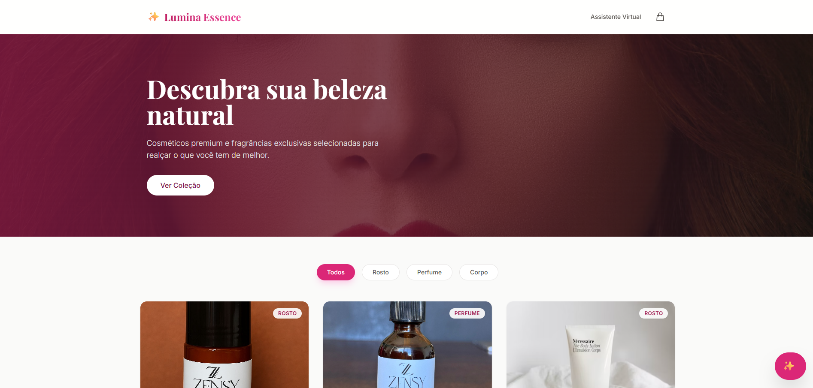
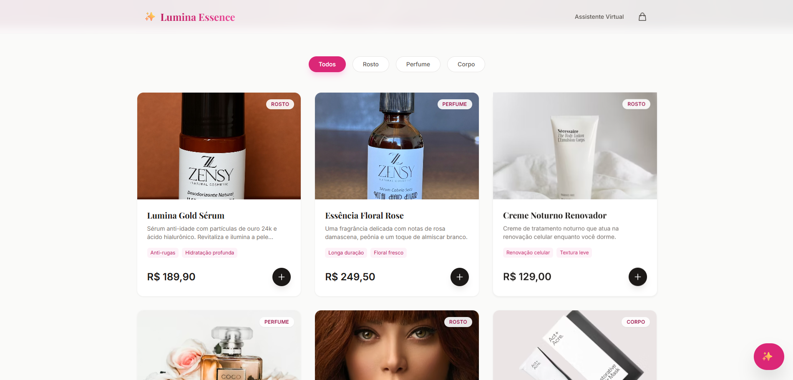
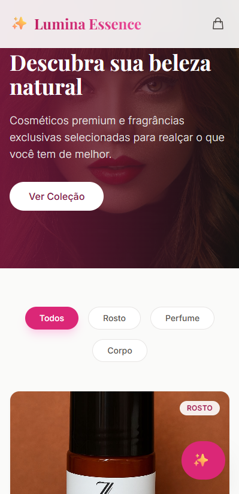
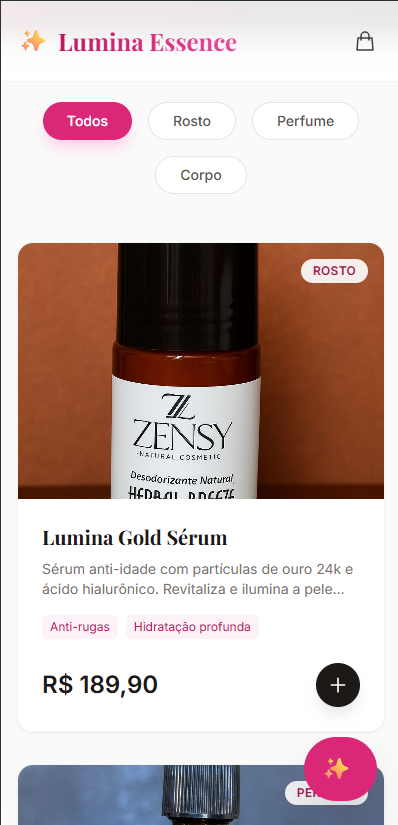

<div align="center">

  <!-- Logo ou Emoji Principal -->
  
  
  <br />

  <h1 align="center">💎 Lumina Essence </h1>

  <p align="center">
    <strong>Loja online</strong>
  </p>

  <!-- Badges de Tecnologias -->
  <p align="center">
    
    
    
    
  </p>
</div>

<br />

## 🚀 Sobre o Projeto

O **Lumina Essence** É um site de vendas online para produtos finos
**UX (Experiência de Usuário)** vendas online

---

## ✨ Funcionalidades Incríveis

### 🌌 1. Landing Page Imersiva
- **Ambientação:** Mostruario de produtos
- **Interatividade:** Modo carrinho
- **Design:** Layout responsivo simulando um navegador dentro da aplicação.

### 🦊 2. Conexão de Carteira (Wallet Connect)
- **Modal Animado:** Efeito de Zoom-in e Fade-in.
- **Múltiplas Opções:** Interface para seleção de MetaMask, WalletConnect, etc.
- **Simulação de Login:** Tela de senha idêntica à extensão oficial da MetaMask.

### 👤 3. Gestão de Perfil (Profile)
- **Upload Inteligente:** Clique no avatar para subir uma foto.
- **Instant Preview:** Visualização da imagem carregada em tempo real (sem recarregar).
- **Feedback Visual:** Inputs estilizados com ícones e validação visual.
- **Confirmação:** Modal de "Sucesso" com redirecionamento automático.

---

## 📸 Previews

| **Landing Page** | **Wallet Modal** |
|:---:|:---:|
|  |  |

| **MetaMask Login** | **Profile & Upload** |
|:---:|:---:|
|  |  |

> *Nota: Substitua as imagens acima pelos prints reais do seu projeto para torná-lo ainda mais impressionante!*

---

## 🛠️ Tecnologias Utilizadas

Este projeto foi construído com as melhores práticas de desenvolvimento web moderno:

*   **[Next.js 14](https://nextjs.org/)** - Framework React para produção (App Router).
*   **[TypeScript](https://www.typescriptlang.org/)** - Tipagem estática para código robusto.
*   **[Tailwind CSS](https://tailwindcss.com/)** - Estilização *utility-first* poderosa.
*   **[Lucide React](https://lucide.dev/)** - Ícones leves e consistentes.
*   **Design Tokens** - Paleta de cores personalizada (Dark gray, Neon Green, Electric Blue).

---

## ⚡ Como Rodar o Projeto

Siga os passos abaixo para ter o Crypto Oasis rodando na sua máquina:

### 1. Clone o repositório
```bash
git clone https://github.com/seu-usuario/crypto-oasis.git
cd crypto-oasis